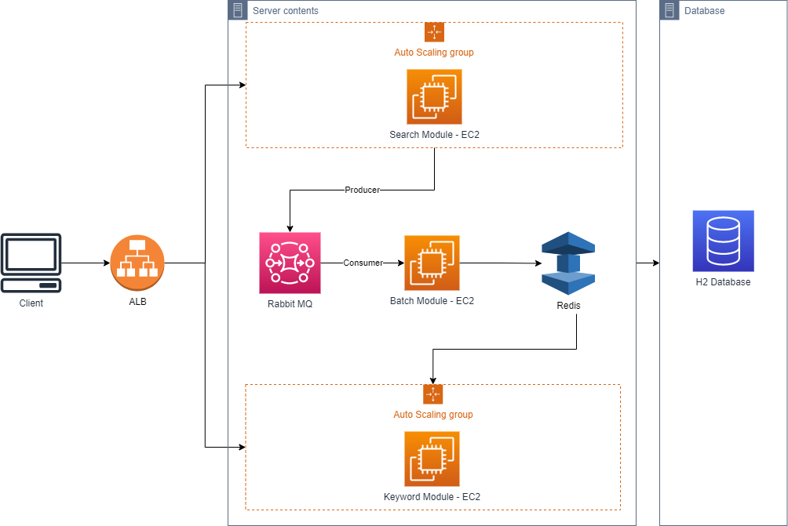

# Environment
- openjdk 11
- spring boot 2.7.8

### gradle Run & jar run script

```
// Project root path 기준

// (Mac Only) gradlew 권한 부여
chmod 755 ./gradlew

// gralde refresh dependencies
./gradlew --refresh-dependencies

// gradle clean & build (jar 생성)
./gradlew :module-search:clean :module-search:build

// jar 실행
java -jar {jar file path} --ex.kakao.apiKey="KakaoAK {카카오 Authorization}" --ex.naver.clientId="{네이버 client id}" --ex.naver.clientSecret="{네이버 client secret}"

// gradle bootrun (local 실행)
./gradlew :module-search:bootRun

```

# Prerequisite to run this project

#### Docker

1. (Window Only) install WSL2
2. install docker desktop

#### H2 Database (Mac)

- https://h2database.com/html/main.html

1. download h2 database
2. run h2

#### Redis in Docker

1. docker pull redis:latest
2. docker run -d --name my-redis -p 11000:6379 redis:latest

#### RabbitMQ in Docker

1. docker pull rabbitmq:3-management-alpine
2. docker run -d --name my-rabbitMQ -p 12000:5672 -p 12010:15672 rabbitmq:3-management-alpine

- 5672 port : 기본 통신 포트
- 15672 port : 서버 포트
- 기본 계정 : ID: guest / PW: guest

# External Rest API Doc

- Kakao Developers : https://developers.kakao.com/docs/latest/ko/daum-search/dev-guide#search-blog
- Naver Developers : https://developers.naver.com/docs/serviceapi/search/blog/blog.md

# Architecture

- Cloud Based Architecture

